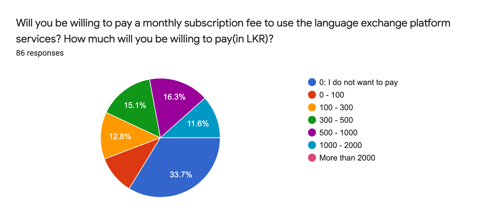
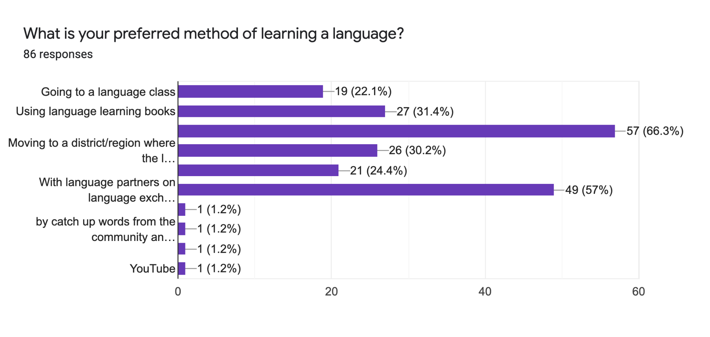
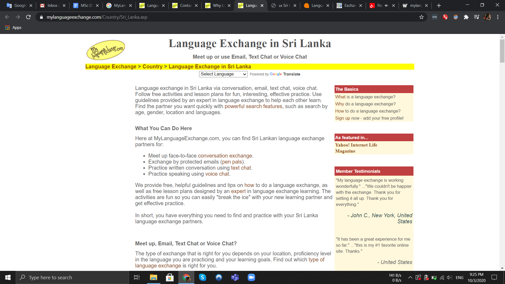
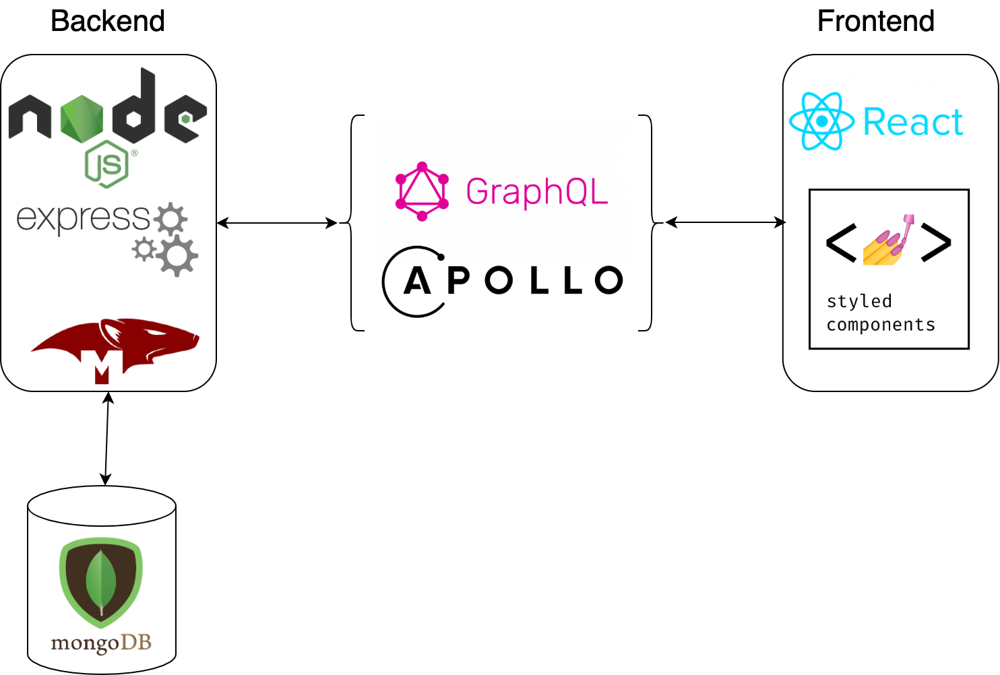
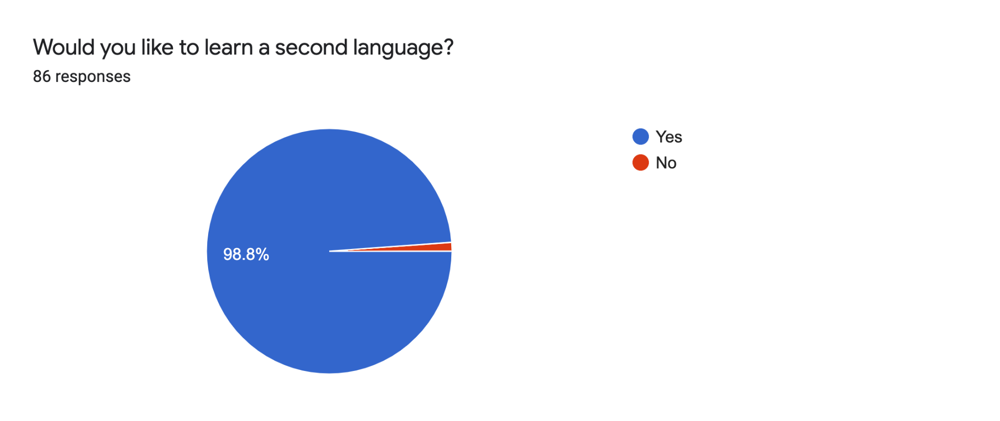
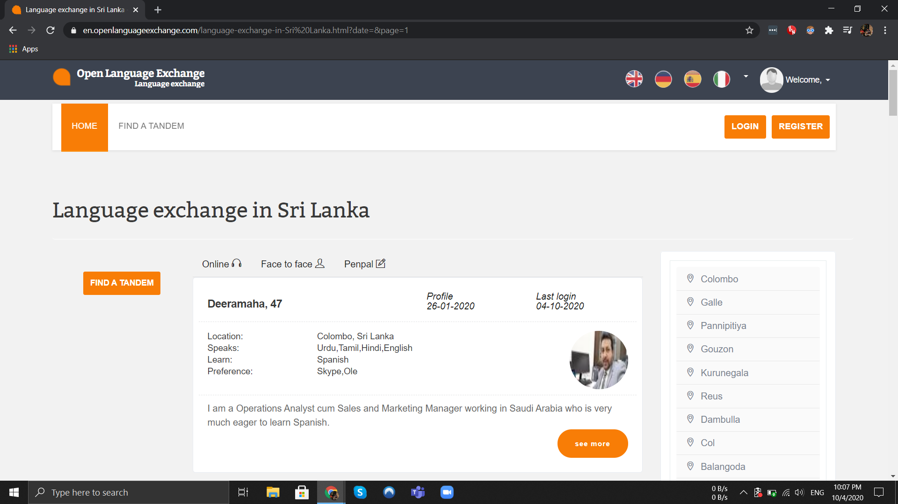
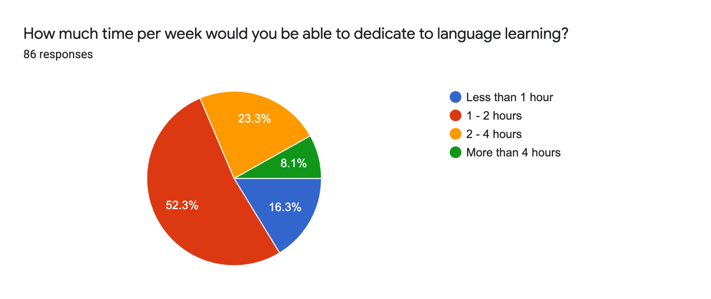
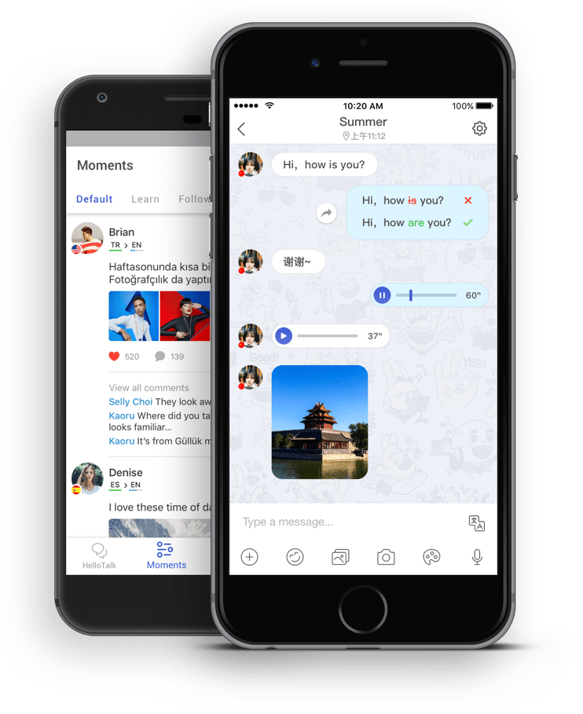
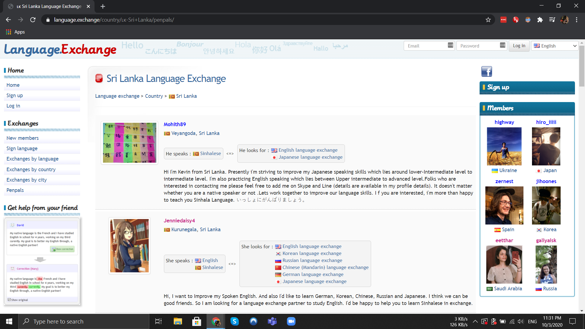
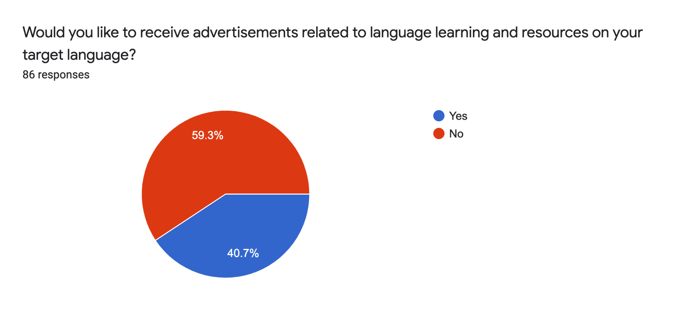

<!-- Copy and paste the converted output. -->

<!-----
NEW: Check the "Suppress top comment" option to remove this info from the output.

Conversion time: 12.936 seconds.


Using this Markdown file:

1. Paste this output into your source file.
2. See the notes and action items below regarding this conversion run.
3. Check the rendered output (headings, lists, code blocks, tables) for proper
   formatting and use a linkchecker before you publish this page.

Conversion notes:

* Docs to Markdown version 1.0β29
* Tue Oct 13 2020 10:35:38 GMT-0700 (PDT)
* Source doc: MSc Dissertation - LangExchangeLK
* Tables are currently converted to HTML tables.
* This document has images: check for >>>>>  gd2md-html alert:  inline image link in generated source and store images to your server. NOTE: Images in exported zip file from Google Docs may not appear in  the same order as they do in your doc. Please check the images!

----->


<p style="color: red; font-weight: bold">>>>>>  gd2md-html alert:  ERRORs: 0; WARNINGs: 0; ALERTS: 17.</p>
<ul style="color: red; font-weight: bold"><li>See top comment block for details on ERRORs and WARNINGs. <li>In the converted Markdown or HTML, search for inline alerts that start with >>>>>  gd2md-html alert:  for specific instances that need correction.</ul>

<p style="color: red; font-weight: bold">Links to alert messages:</p><a href="#gdcalert1">alert1</a>
<a href="#gdcalert2">alert2</a>
<a href="#gdcalert3">alert3</a>
<a href="#gdcalert4">alert4</a>
<a href="#gdcalert5">alert5</a>
<a href="#gdcalert6">alert6</a>
<a href="#gdcalert7">alert7</a>
<a href="#gdcalert8">alert8</a>
<a href="#gdcalert9">alert9</a>
<a href="#gdcalert10">alert10</a>
<a href="#gdcalert11">alert11</a>
<a href="#gdcalert12">alert12</a>
<a href="#gdcalert13">alert13</a>
<a href="#gdcalert14">alert14</a>
<a href="#gdcalert15">alert15</a>
<a href="#gdcalert16">alert16</a>
<a href="#gdcalert17">alert17</a>

<p style="color: red; font-weight: bold">>>>>> PLEASE check and correct alert issues and delete this message and the inline alerts.<hr></p>


## CHAPTER ONE – INTRODUCTION (2330)


### 1.1 – Background of the Study

Sri Lanka is a multi-ethnic, multi-linguistic country where three languages are widely spoken. They are Sinhala, Tamil, and English. Many people take language classes for several years without being able to have a simple communication with a native speaker of the language they are learning. Even at language schools, Sri Lankans don’t get enough chances to use their target language (target language is the language one is trying to learn). In addition, it is next to impossible to find a native speaker of your target language in your class. This further limits a students chances to practice their target language. This project aims to develop a language exchange platform as a web application where language learners in Sri Lanka can meet native speakers of their target language and learn together.

Culturally, Sri Lankans are rather afraid of making mistakes or embarrassing themselves in front of others. However, this is the primary requirement to acquire a second language. We need to make mistakes happily a lot of times before we can start speaking comfortably in a second language. An online platform to meet and practice language will eliminate or at least reduce the reluctance of language learners to use their target language more often.


### 1.2 – Problem Identification


#### 1.2.1 Symptoms of the Problem

Sri Lanka has a deep language divide. Sri Lankans like to form their identity around their mother tongue and merrily ignore other languages [4]. The civil unrest in the country could be partially attributed to this language divide that exists in the society. A regional divide compounds this problem. That is, the residents of certain regions speak only Sinhala, and other regions speak only Tamil. In a city like Colombo you could find a native speaker of both languages. However, outside of cities, most regions are monolingual. So even if you want to learn a second language, you simply cannot find a native speaker around. This is where the proposed project aims to make an impact. Even if you live in a monolingual region in Sri Lanka, you can find a language partner from the comfort of your home using the language exchange platform - named LangExchange LK.

People in South Asia find it difficult to practice a foreign language in their home or educational environments due to cultural factors. This plays a significant role in the failure to acquire second language for most Sri Lankans [6]. Historically, two languages were spoken in Sri Lanka. They were Tamil and Sinhala. The colonial rule of British during 1815 to 1948 brought English into the then Ceylon. English has stayed on as the preferred language of tertiary education and language of business in the majority of the registered companies in Sri Lanka. There is also a small but rising number of native English speakers in Sri Lanka [7]. Native English speakers are mainly found in urban areas such as Colombo or Kandy in Sri Lanka. Due to these various factors, English has also developed into a language used widely by Sri Lankans. Hence, in today’s context, fluency in all these three languages is essential to lead a fulfilling life in Sri Lanka.


#### 1.2.2 Justification of the project

A survey on language learning was carried out in order to understand the market of this project [Appendix 1?]. 86 people of different districts, and different native languages responded to the  survey [Appendix 2?]. 98.8% of the responders said that they would like to learn a second language.


<p id="gdcalert1" ><span style="color: red; font-weight: bold">>>>>>  gd2md-html alert: inline image link here (to images/image1.png). Store image on your image server and adjust path/filename/extension if necessary. </span><br>(<a href="#">Back to top</a>)(<a href="#gdcalert2">Next alert</a>)<br><span style="color: red; font-weight: bold">>>>>> </span></p>





When asked for the preferred mode of learning a language, language exchange platform was the second most popular answer just behind watching audiovisual media on the target language. 57% of the people mentioned that they will be willing to use an online language platform such as the one this project aims to build. The third most popular way was learning with language books. This shows that there is a market need for such a project in the country.


<p id="gdcalert2" ><span style="color: red; font-weight: bold">>>>>>  gd2md-html alert: inline image link here (to images/image2.png). Store image on your image server and adjust path/filename/extension if necessary. </span><br>(<a href="#">Back to top</a>)(<a href="#gdcalert3">Next alert</a>)<br><span style="color: red; font-weight: bold">>>>>> </span></p>





In addition, 66.3% of the respondents said they are willing to pay a monthly subscription to use such a language exchange platform. 27.9% of the responders were willing to pay more than LKR 500 per month. This demonstrates the financial feasibility of this project and its ability to attract paid users. This further shows the commitment of the potential users towards such a web application and its utility. Since this project is a platform rather than a resource website for language learning, the maintenance cost is down to only hosting, domain name, and support expenditures. The initial development cost will be a one time cost and after the initial development the focus can be shifted to marketing and promotions. The content on this website will be generated by the users and the admins will assume a role of mere moderators.


<p id="gdcalert3" ><span style="color: red; font-weight: bold">>>>>>  gd2md-html alert: inline image link here (to images/image3.png). Store image on your image server and adjust path/filename/extension if necessary. </span><br>(<a href="#">Back to top</a>)(<a href="#gdcalert4">Next alert</a>)<br><span style="color: red; font-weight: bold">>>>>> </span></p>





The following pie chart shows the amount of time per week the respondents are willing to commit to learning a language. 83.7% of the respondents are ready to spend more than one hour per week on language learning activities. This could translate to at least one hour of usage of our platform if designed properly. Even an hour per week of usage is good enough to build a web application with a successful business [8]. It is also noteworthy that slightly more than 50% of the respondents have said they are ready to spend between 1-2 hours per week.


<p id="gdcalert4" ><span style="color: red; font-weight: bold">>>>>>  gd2md-html alert: inline image link here (to images/image4.png). Store image on your image server and adjust path/filename/extension if necessary. </span><br>(<a href="#">Back to top</a>)(<a href="#gdcalert5">Next alert</a>)<br><span style="color: red; font-weight: bold">>>>>> </span></p>





Furthermore, 40.7% of the respondents have said they are willing to receive targeted advertisements based on their profile and behaviour.


<p id="gdcalert5" ><span style="color: red; font-weight: bold">>>>>>  gd2md-html alert: inline image link here (to images/image5.png). Store image on your image server and adjust path/filename/extension if necessary. </span><br>(<a href="#">Back to top</a>)(<a href="#gdcalert6">Next alert</a>)<br><span style="color: red; font-weight: bold">>>>>> </span></p>





This paves the way for more commercialization of this project by collaborating with language learning resource providers like language schools, bookshops and promoting their product to suitable users on the platform. The conversion rate will be high in this mode of advertising because the users are generally self-motivated individuals who are able and willing to acquire resources related to language learning. Compared to promoting on a general social media platform like Facebook, this platform will be more effective for the promotion partners.


#### ~~1.2.3 Defining Research Problem~~


### ~~1.3 – Research Question~~


### 1.4 – Objectives of the Project

The objective of this project is to develop an online platform where language learners in Sri Lanka can meet other language learners. We will name the platform LangExchangeLK. At LangExchange LK one can learn Tamil, Sinhala, and English. For example, if you are a native Sinhala speaker, and you want to learn Tamil, you can register with the relevant information at [www.langexchange.lk](http://www.langexchange.lk). You will be able to explore native Tamil speakers who wish to learn Sinhala. You can follow their profile to get updates about their posts. You can message them directly and start a conversation. You can message in English, Tamil, or Sinhala. If the receiver prefers, he or she will respond and you both can begin language exchange. You can teach him / her Sinhala, while learning Tamil with their help. You also have another explore option where you can see the posts of all native Tamil speakers who wish to learn Sinhala in an “Explore” page whether you follow them or not. In this page, one can share language learning resources and thoughts that will help the community.

Through this platform, we hope to enable people living in all corners of the country to be able to exchange language. The limitations and problems faced by a linguistic student discussed in section 1.2.1 will be minimized once this project materialises. Even if you live in a remote monolingual region in Sri Lanka, you will be able to meet a native speaker. This will enable the students to have more practice in their target language. In addition, an online platform provides enough masquerade for even shy persons to start practicing. Since the users are connected with equally aspiring learners, there will be no room for judgement or discouragement. In case if a user does not like his or her language partner, he or she can look for another partner in no time.

Through the explore page, a user will be able to share his or her thoughts on the language they are learning, resources and links, and even write an essay in their target language and ask others to correct it. Another advantage of having this explore page is to allow a user to find someone immediately when he is having some free time. If his or her language partner is not available at some time, users can immediately post on the explore page requesting a conversation with whoever available at that point in time.

Another important objective of this project is to adopt this platform to suit the local context. The expectations of Sri Lankans with regard to such a platform is different from European language exchange platforms. There are unique privacy concerns that need to be addressed. In order to understand the local context and general market for this product a survey was done. The results of this survey will be discussed in chapter four.


### 1.5 – Significance of the Project

This project aspires to address one of the fundamental issues faced by the country which is lack of bilingualism and understanding of languages other than one’s mother tongue. Bilingualism is imperative for a multi-ethnic, multi-ethnic society to thrive. An online language exchange platform will greatly help the cause of increasing bilingualism in our country. This website will be free for everyone to register. Hence, everyone with internet access will be able to profit from this project.

Sinhala-Tamil bilingualism will promote communal harmony by augmenting the understanding between them. When one knows another language, he or she will start understanding their culture and start developing an empathy for other cultures. Meanwhile, Sinhala-English, or Tamil-English will provide more job opportunities and international exposure to the learners. It is established that lack of English knowledge triggered partially by linguistic nationalistic movements have harmed the economy and prosperity [2].

By contrast, Singapore which embraced English with open arms was able to attract international business opportunities at a very high rate [3]. When a multinational company looks for a country to open their next office, they will most certainly look at the English proficiency among the population. This is because almost all international business is done in English and the language of operation for most of the international companies is English.

To the best of our knowledge, there is no parallel project or product targeting Sri Lankan users available on the market. Even though there are international platforms where Sri Lankan users are able to register, they usually lack support for local languages such as Tamil or Sinhala. So far, the preferred mode of learning a language in Sri Lanka has been tuition classes. Even after years of following classes, some people fail to acquire basic knowledge of the language. However, this exchange platform will, by its nature, make the users converse in their target language since day one.


### 1.6 – Limitations of the Project

TODO: Add feature request from the survey

The limitations of this project are threefold. Firstly, this is an online platform. So the assumption is a language learner will have access to a computer or a mobile phone with an internet connection. However, the internet penetration rate in Sri Lanka is around 34% [1]. So the rest 66% of the population will not be able to use this platform. On the other hand, the younger population will have more access to the internet than the older generation. The primary target of this platform is adolescents and young adults. So among this slice of population, the internet penetration will be more than 34%.

Secondly, not all features of a full-fledged production-ready platform will be implemented at the end of this project. Some of the excluded features are, audio and video calling, adding support for a special type of user - teacher, and support for uploading video content. This will have an impact on the utilizability of this platform. However, further development can be done on this project extending it and adding the missing features. The architecture of this project will allow such additions in the future.

In addition, the success of this project depends on the adoption among the users. A new user will be interested in joining and using this platform only if at least a few dozen potential language partners are already available on the site. This initial momentum can be provided by paying initial users to be active for a few months, or other targeted promotions like in person promotion at language schools all over the country. Once this initial number of people start using the platform on a regular basis, then it will become self-sustaining and new users will join for the high number of potential matches awaiting him or her.

Another limitation is the lack of access to internet and internet connected devices among students. Traditionally, Sri Lankan students are deliberately denied access to the internet at their schools and homes to make them focus more on learning based on books. Since this is a digital platform, it could be difficult to reach students who are a potentially significant user group. However, with the coronavirus pandemic, the shift towards online education has begun in Sri Lanka, and parents, teachers, and administrators have started to understand the significance of internet access. This shift will indirectly help this project by making a once unreachable user segment reachable through the internet.


### 1.7 – Chapter Outline


## CHAPTER TWO – REVIEW OF EXISTING SOLUTIONS (1790)

To the best of our knowledge, there is no online language exchange platform specifically for Sri Lankans. However, there are international language exchange platforms where Sri Lankans can get registered and find a language partner. The following are some of the websites where language learners from Sri Lanka can find a language partner. look for papers that talk about language exchange


### 2.1 Language Exchange Websites


#### 2.1.1 My Language Exchange - https://www.mylanguageexchange.com/

My Language Exchange is a Canadian language exchange website which was started in 2000 in Ontario. This website has a dedicated page for Sri Lanka [9] where you can meet fellow Sri Lankan language learners.


<p id="gdcalert6" ><span style="color: red; font-weight: bold">>>>>>  gd2md-html alert: inline image link here (to images/image6.png). Store image on your image server and adjust path/filename/extension if necessary. </span><br>(<a href="#">Back to top</a>)(<a href="#gdcalert7">Next alert</a>)<br><span style="color: red; font-weight: bold">>>>>> </span></p>





On this page you can search for language exchange partners using filters such as native language, practicing language, city, age, gender, and the prefered method of contact. This website has good search engine optimization and appears as the first result for the search phrase “language exchange sri lanka”. This website is active and hundreds of registered Sri Lankan language learners are using this website.

However, the website looks very outdated and lacks the modern web development concepts such as responsiveness, optimization for mobile screens, etc. This platform also lacks instant messaging features. Users meet on this platform and then move onto other communication platforms such as Skype, WhatsApp, or E-mail. So the users will generally spend some initial time on this website to search and find a suitable language partner and then stop or reduce visiting this website. This model is not sustainable for a successful business.

This platform has a language partner explore page which can be found at [10]. There are around 10400 users to browse from. It is also notable that this website supports other languages such as European ones. Hence, there are Sri Lankan users who are looking to learn languages such as French, German, Korean, Chinese, Russian, Italian, Japanese etc. can also be found on this page.

There are two types of membership options. One is “Regular Member” and the other is “Gold Member”. Regular membership is free whereas gold membership costs a monthly recurring subscription fee. For one month it costs 6 USD. However, you can save on the subscription by paying 12 USD for 3 months or 24 USD for 12 month subscriptions. Gold members can initiate contact with unlimited number of members and they can also post, edit messages on their bulletin board.


#### 2.1.2 Language.Exchange - https://language.exchange/

Language Exchange is a website started in 2015 in France. It also has a dedicated page for Sri Lanka which can be accessed at [11]. The website can be translated into 13 languages. However, Tamil or Sinhala is not one of them so Sri Lankan users are left with using the website in English.


<p id="gdcalert7" ><span style="color: red; font-weight: bold">>>>>>  gd2md-html alert: inline image link here (to images/image7.png). Store image on your image server and adjust path/filename/extension if necessary. </span><br>(<a href="#">Back to top</a>)(<a href="#gdcalert8">Next alert</a>)<br><span style="color: red; font-weight: bold">>>>>> </span></p>





There is no filter available to narrow down the search of language partners like city, sex, etc. filters. So it is difficult to find a user that we desire through the interface. Most users will end up contacting a user they see on the first few pages. This is not an ideal situation since language partners become close over time and they need to be able to get along well. In addition, if we can meet language partners from the same city, we can even arrange a face to face meeting after a while.

This solution also suffers from outdated web application technologies. The web page is static, and is not responsive for the screen size or mobile devices. Around 52% of web traffic worldwide is generated from mobile devices (excluding tablets) [12]. So it is imperative to adopt new technologies to stay relevant in this fast changing internet environment.

This website is completely free to get registered and to use. There are no premium features and all the features are available to all users. As a result, even users from developing countries can take full advantage of this platform. However, on the other hand, it is difficult to find revenues or funding to hire engineers to maintain and update this web application since this has no business model.

There are around 250 registered users from Sri Lanka on this website. The less popularity of this application can be attributed to the lack of search engine optimization. This application has support for sending messages within the website. However, this is more like an e-mail rather than an instant messaging since it does not show online information of the user, nor the messages are instantaneous. It is notable that sent messages can be corrected with highlighting by the receiver.


#### 2.1.3 Open Language Exchange - https://en.openlanguageexchange.com/

Open Language Exchange is a website founded in 2011 in Spain. This platform also has a dedicated page for Sri Lankan users. You can access the page at [14]. This website cannot be accessed in Sinhala or Tamil however, English version of the website is available.


<p id="gdcalert8" ><span style="color: red; font-weight: bold">>>>>>  gd2md-html alert: inline image link here (to images/image8.png). Store image on your image server and adjust path/filename/extension if necessary. </span><br>(<a href="#">Back to top</a>)(<a href="#gdcalert9">Next alert</a>)<br><span style="color: red; font-weight: bold">>>>>> </span></p>





This website has responsive and mobile screen support. The website is attractive and language partners are termed as “Tandem” on this platform. Multiple types of desired communication medium such as Skype, Google Talk, WhatsApp, Facetime etc can be listed for contact with potential language partners. However, a direct messaging feature within the website is not available.

In addition, this website does not support Sinhala as a language for exchange but Tamil is available. There are also only around 20 registered users from Sri Lanka. However, the location settings on this website is inaccurate, and hence some users outside Sri Lanka are classified as Sri Lankan users. This website also provides a city based filtering of users which can be used to prevent reaching misclassified users. For example, if you want to find a language partner from Colombo, you can visit the Colombo page within Sri Lanka to explore users from Colombo.

This website is completely free to use by all users. There are no premium or locked features so all users get to enjoy the full range of services available on the site. However, due to lack of careful development, there are translation errors all over the website. For example, on the interface for contacting users, Spanish titles get rendered. These developmental overlooks can be attributed to the fact that this website is free and hence they don’t spend much on maintenance. There are also a very small number of Sri Lankan users so the country specific pages might have been deprioritized during development.

This platform provides three special filters such as “Online”, “Face-to-face”, and “Penpal” which are listed as tabs on the explore page. You can visit these tabs to explore users who only prefer online communication or only prefer face to face communication. So this platform can be used to find a real life language partner whom you can meet and talk.


#### 2.1.4 HelloTalk - https://www.hellotalk.com/?lang=en

This is a predominantly mobile application based language exchange platform. HelloTalk supports 150+ languages for exchange and has over 20 million users worldwide according to the claims of developers. HelloTalk is available as Android and iOS applications for download on respective application stores. The Android version of this application has been downloaded over 10 million times. This project was started in 2012 by Zackery Ngai [15]. HelloTalk now has offices in Hong Kong and Shenzhen, China.


<p id="gdcalert9" ><span style="color: red; font-weight: bold">>>>>>  gd2md-html alert: inline image link here (to images/image9.png). Store image on your image server and adjust path/filename/extension if necessary. </span><br>(<a href="#">Back to top</a>)(<a href="#gdcalert10">Next alert</a>)<br><span style="color: red; font-weight: bold">>>>>> </span></p>





HelloTalk is one of the most feature rich language exchange applications. They have a user search system with filters for country, city, languages spoken, etc. Voice-to-text feature is available to convert a voice message from your partner to text in case you don’t understand what is being said. Text-to-speech is also available to learn pronunciation of new words. Transliteration feature is available to convert the pronunciation of one word to a written form in your native language. Translation service is available within the chat message window to help one understand the received messages. You can also make free video and audio calls within the application itself which removes the need for moving to another platform such as Skype or WhatsApp entirely. This also helps protect a user’s privacy as there is no need to exchange mobile numbers or emails. You can keep a personal dictionary called “Favorites” where you can store words, sentences, audio files, pictures etc for future reference. Automated grammar correction as well as correction of messages by language partners is supported in this platform.

Tamil and Sinhala languages are also available on this platform for exchange, however, there is limited support for translation and text to speech features when it comes to Sinhala. HelloTalk has no concept of followers or friends. All users stay in equal state for all other potential language partners. However, the users with whom you have initiated a conversation are shown on the messages tab.

HelloTalk has a premium membership which costs LKR 1290 per month or LKR 6700 per year or LKR 19750 for lifetime membership. Premium membership is called HelloTalk VIP and premium members can learn and teach upto three languages at one time. Free users can only learn one language and teach one language.


### 2.2 Advantages of our solution

It should be noted that most of the Sri Lankan users on the aforementioned platform are looking to learn English. In return, Sri Lankan users offer Sinhala or Tamil. However, there are not many native English speakers in the world who are looking to learn Tamil or Sinhala. Spanish, French and Mandarin are among the most sought after second languages by native English speakers [13]. So finding a matching language partner is difficult on these international websites. On the other hand, native English speakers in Sri Lanka are more likely and willing to learn Sinhala and Tamil as their second language. This increases the chances of finding a language partner.

It is clear from these existing platforms that there is a huge need for language exchange among Sri Lankan users. However, so far this need has not been met properly due to the lack of a locally focused solution. There are several privacy requirements unique to Sri Lanka as stated in the responses to the survey like,

_“It would be better if not too much personal information is required while signing up for the platform and also need a facility where we can stop contacting a person who minuses the platform without any worries”_

_“Should be able to hide personal information from others.”_

_“To learn without misusable personal details (example: phone number, photo)”_

The rest of the responses can be found in the answers to the question “What privacy settings do you expect on the platform and what steps do you expect administrators to take to prevent misuse and exploitation?” in appendix 2.


## CHAPTER THREE – DEVELOPMENT METHODOLOGY (2500)

LangExchange LK web application was built using the MERN stack. That is MongoDB as the database, Express as the server, React JS for the front end Javascript library and Node as the server side framework. This is a very popular technology stack for developing web applications these days [16].

MongoDB was chosen for its simplicity and scalability. It is a database of documents, which are JSON-like (JavaScript Object Notation) data with querying support. It can run on moderately powerful computers which makes it very developer friendly. We don’t need to set up a database server, we can just download and install MongoDB on the developer machine and get going. However, one disadvantage of MongoDB is the absence of database joins. For the purpose of our web application, it was deemed that joins are not essential, and can be handled within MongoDB with minimal data redundancy.

Express has become the de facto web application framework for Node.js. It has a smooth integration with Node and saves a lot of time for developers by eliminating the need of writing servers. In addition, a development server can easily start up on commodity hardware while still being optimized for actual production environments in a server.

React JS was originally developed by Facebook for their web application and subsequently open sourced. It is essentially a frontend library and not a frontend framework like Angular. React uses a virtual DOM which renders only the changed components within a page. This gives the website the feeling of a native application. React enables the development of single page web applications. Since it is necessary to give native app-like feel in our language exchange platform React was chosen as the frontend library. In addition, React uses JSX files which allow the co-existence of HTML, JavaScript, and CSS scripts on the same file. This improves the readability of the code since all code related to a component will be found in a single file.

Node.js is a Javascript runtime environment built using Google Chrome JavaScript engine version 8. This runtime is quick in execution and is very scalable. It is aggressively maintained by Google and regularly updated with new features.

All components of MERN stack are open source. So there is no need to obtain a license if we ever decide to commercialize our application. In addition, React JS and Node.js allow the same code to be executed concurrently in the client side as well as server side. Hence the application will be in total sync and function smoothly.


### 3.1 Software Development Life Cycle - Waterfall

Spiral SDLC was chosen for the development of LangExchangeLK. This is because, it was better to start implementation with basic set of requirements and producing an application and then iteratively improve the product in subsequent cycles of development after feedback from the supervisor. However, the first cycle covered majority of the identified requirements and majority of the implemented features. So, the development can also be considered as a mix of waterfall and spiral SDLC.


<p id="gdcalert10" ><span style="color: red; font-weight: bold">>>>>>  gd2md-html alert: inline image link here (to images/image10.png). Store image on your image server and adjust path/filename/extension if necessary. </span><br>(<a href="#">Back to top</a>)(<a href="#gdcalert11">Next alert</a>)<br><span style="color: red; font-weight: bold">>>>>> </span></p>





(Source: [https://airbrake.io/blog/sdlc/spiral-model](https://airbrake.io/blog/sdlc/spiral-model))


#### 3.1.1 First Cycle

This was the major cycle of the development. At the start of this cycle the survey that we discussed in chapter one was performed and the following feature requirements were identified.


<p id="gdcalert11" ><span style="color: red; font-weight: bold">>>>>>  gd2md-html alert: inline image link here (to images/image11.png). Store image on your image server and adjust path/filename/extension if necessary. </span><br>(<a href="#">Back to top</a>)(<a href="#gdcalert12">Next alert</a>)<br><span style="color: red; font-weight: bold">>>>>> </span></p>


The following features were finalized for implementation during this cycle.


*   Login / Signup, Profile, Home, Learners, Messages page
*   Search bar
*   Instant messaging
*   Write posts and comments, like a post
*   Follow users

In the second stage of this cycle, the architecture of the system as a whole was designed. The web application developed contains two independent runtimes, backend and frontend, which communicate through a GraphQL API.


<p id="gdcalert12" ><span style="color: red; font-weight: bold">>>>>>  gd2md-html alert: inline image link here (to images/image12.png). Store image on your image server and adjust path/filename/extension if necessary. </span><br>(<a href="#">Back to top</a>)(<a href="#gdcalert13">Next alert</a>)<br><span style="color: red; font-weight: bold">>>>>> </span></p>


GraphQL was chosen instead of a simpler REST API because it allows us to request for only the fields that we require from the frontend. This is in contrast to retrieving the entire JSON payload by calling a REST endpoint and then parsing the JSON to find the required value. Hence, GraphQL allows us to save bandwidth in frontend - backend communication by receiving only required data and as a consequence, improves the speed of frontend application. GraphQL is not actually a software program [17]. It is rather a data query and manipulation language for API’s. It is a set of definitions and rules. It was developed by Facebook in 2012 and then subsequently released for open source usage in 2015 [18]. There exist many implementations of this specification. I have chosen Apollo GraphQL platform [19] which provides both a GraphQL server to be used in the backend and a GraphQL client to be used in the frontend.


##### Architecture of the Backend System

The backend is developed using Node.js, a Javascript runtime. Backend handles requests from the frontend and responds with appropriate data. Backend also handles data persistence and reading from MongoDB. Let’s begin the analysis of the backend with a review of data modelling. The data models are defined using Mongoose JS library schemas.


###### Data Models

User model holds data related to each user. This data contains both user’s personal data and platform specific data such as the user’s followers etc.


<table>
  <tr>
   <td colspan="5" ><strong>User </strong>(timestamps: true)
   </td>
  </tr>
  <tr>
   <td><strong>Field</strong>
   </td>
   <td><strong>Type</strong>
   </td>
   <td><strong>Required</strong>
   </td>
   <td><strong>Reference</strong>
   </td>
   <td><strong>Other Constraints</strong>
   </td>
  </tr>
  <tr>
   <td>fullName
   </td>
   <td>String
   </td>
   <td>true
   </td>
   <td>
   </td>
   <td>
   </td>
  </tr>
  <tr>
   <td>email
   </td>
   <td>String
   </td>
   <td>true
   </td>
   <td>
   </td>
   <td>lowercase, trim, unique
   </td>
  </tr>
  <tr>
   <td>username
   </td>
   <td>String
   </td>
   <td>true
   </td>
   <td>
   </td>
   <td>lowercase, trim, unique
   </td>
  </tr>
  <tr>
   <td>nativeLanguage
   </td>
   <td>String
   </td>
   <td>true
   </td>
   <td>
   </td>
   <td>
   </td>
  </tr>
  <tr>
   <td>targetLanguage
   </td>
   <td>String
   </td>
   <td>true
   </td>
   <td>
   </td>
   <td>
   </td>
  </tr>
  <tr>
   <td>introduction
   </td>
   <td>String
   </td>
   <td>false
   </td>
   <td>
   </td>
   <td>
   </td>
  </tr>
  <tr>
   <td>age
   </td>
   <td>Number
   </td>
   <td>false
   </td>
   <td>
   </td>
   <td>
   </td>
  </tr>
  <tr>
   <td>sex
   </td>
   <td>String
   </td>
   <td>false
   </td>
   <td>
   </td>
   <td>
   </td>
  </tr>
  <tr>
   <td>city
   </td>
   <td>String
   </td>
   <td>false
   </td>
   <td>
   </td>
   <td>
   </td>
  </tr>
  <tr>
   <td>passwordResetToken
   </td>
   <td>String
   </td>
   <td>false
   </td>
   <td>
   </td>
   <td>
   </td>
  </tr>
  <tr>
   <td>passwordResetTokenExpiry
   </td>
   <td>Date
   </td>
   <td>false
   </td>
   <td>
   </td>
   <td>
   </td>
  </tr>
  <tr>
   <td>password
   </td>
   <td>String
   </td>
   <td>true
   </td>
   <td>
   </td>
   <td>
   </td>
  </tr>
  <tr>
   <td>image
   </td>
   <td>String
   </td>
   <td>false
   </td>
   <td>
   </td>
   <td>
   </td>
  </tr>
  <tr>
   <td>imagePublicId
   </td>
   <td>String
   </td>
   <td>false
   </td>
   <td>
   </td>
   <td>
   </td>
  </tr>
  <tr>
   <td>isOnline
   </td>
   <td>Boolean
   </td>
   <td>false
   </td>
   <td>
   </td>
   <td>default: false
   </td>
  </tr>
  <tr>
   <td>posts
   </td>
   <td>Array of Schema.Types.ObjectId
   </td>
   <td>false
   </td>
   <td>Post
   </td>
   <td>
   </td>
  </tr>
  <tr>
   <td>likes
   </td>
   <td>Array of Schema.Types.ObjectId
   </td>
   <td>false
   </td>
   <td>Like
   </td>
   <td>
   </td>
  </tr>
  <tr>
   <td>comments
   </td>
   <td>Array of Schema.Types.ObjectId
   </td>
   <td>false
   </td>
   <td>Comment
   </td>
   <td>
   </td>
  </tr>
  <tr>
   <td>followers
   </td>
   <td>Array of Schema.Types.ObjectId
   </td>
   <td>false
   </td>
   <td>Follow
   </td>
   <td>
   </td>
  </tr>
  <tr>
   <td>following
   </td>
   <td>Array of Schema.Types.ObjectId
   </td>
   <td>false
   </td>
   <td>Follow
   </td>
   <td>
   </td>
  </tr>
  <tr>
   <td>notifications
   </td>
   <td>Array of Schema.Types.ObjectId
   </td>
   <td>false
   </td>
   <td>Notification
   </td>
   <td>
   </td>
  </tr>
  <tr>
   <td>messages
   </td>
   <td>
   </td>
   <td>false
   </td>
   <td>User
   </td>
   <td>
   </td>
  </tr>
</table>


The fields which have “true” for the “Required” column should be passed when a User is created. The other fields are optional, and can be added later after adding the user. Email and username fields have additional conditions to be unique, lowercase and without any whitespace (trim). The isOnline field is set to false by default, It will be set to true when the user is online i.e actively browsing the LangExchange application. The fields that have a reference are used to link entries in other documents to a particular user. For example, take the field “post”. It is an array of ObjectIds of post data. The posts made by a user will be linked to the account using this reference array. Setting the timestamps as true will automatically keep track of created and last updated time of each document within the collection.


<table>
  <tr>
   <td colspan="5" ><strong>Post </strong>(timestamps: true)
   </td>
  </tr>
  <tr>
   <td><strong>Field</strong>
   </td>
   <td><strong>Type</strong>
   </td>
   <td><strong>Required</strong>
   </td>
   <td><strong>Reference</strong>
   </td>
   <td><strong>Other Constraints</strong>
   </td>
  </tr>
  <tr>
   <td>title
   </td>
   <td>String
   </td>
   <td>false
   </td>
   <td>
   </td>
   <td>
   </td>
  </tr>
  <tr>
   <td>image
   </td>
   <td>String
   </td>
   <td>false
   </td>
   <td>
   </td>
   <td>
   </td>
  </tr>
  <tr>
   <td>imagePublicId
   </td>
   <td>String
   </td>
   <td>false
   </td>
   <td>
   </td>
   <td>
   </td>
  </tr>
  <tr>
   <td>author
   </td>
   <td>Schema.Types.ObjectId
   </td>
   <td>false
   </td>
   <td>User
   </td>
   <td>
   </td>
  </tr>
  <tr>
   <td>authorNativeLanguage
   </td>
   <td>String
   </td>
   <td>false
   </td>
   <td>
   </td>
   <td>
   </td>
  </tr>
  <tr>
   <td>authorTargetLanguage
   </td>
   <td>String
   </td>
   <td>false
   </td>
   <td>
   </td>
   <td>
   </td>
  </tr>
  <tr>
   <td>likes
   </td>
   <td>Array of Schema.Types.ObjectId
   </td>
   <td>false
   </td>
   <td>Like
   </td>
   <td>
   </td>
  </tr>
  <tr>
   <td>comments
   </td>
   <td>Array of Schema.Types.ObjectId
   </td>
   <td>false
   </td>
   <td>Comment
   </td>
   <td>
   </td>
  </tr>
</table>


None of the fields in the post schema is mandatory. However, usually the title and the author fields are necessary. Title holds the text of the post and author holds the ObjectId of the user who wrote the post. It is important to note that even if the type of author is Schema.Types.ObjectId, it is not an array. Only one ObjectId exists in the field’s value. We cannot have multiple authors for a single post.

The fields authorNativeLanguage, and authorTargetLanguage and respectively the nativeLanguage and targetLanguage of the author. This information can be retrieved from the user document using the user ObjectId. However, as we noted in the introduction of chapter three, such data duplication is necessary in light of the absence of table joins in MongoDB. 

We have an explore page where we show the posts of users who have compatible languages. To retrieve this list of posts, we need the language information of the author. Even though it is possible to first retrieve the post and then using the user ObjectId retrieve the relevant language information from the user document. This process involves two database access which is slow as the database is persisted in harddisk. Hard disk space is traded off to gain time during retrieval.


<table>
  <tr>
   <td colspan="5" ><strong>Notification </strong>(timestamps: true)
   </td>
  </tr>
  <tr>
   <td><strong>Field</strong>
   </td>
   <td><strong>Type</strong>
   </td>
   <td><strong>Required</strong>
   </td>
   <td><strong>Reference</strong>
   </td>
   <td><strong>Other Constraints</strong>
   </td>
  </tr>
  <tr>
   <td>author
   </td>
   <td>Schema.Types.ObjectId
   </td>
   <td>false
   </td>
   <td>User
   </td>
   <td>
   </td>
  </tr>
  <tr>
   <td>user
   </td>
   <td>Schema.Types.ObjectId
   </td>
   <td>false
   </td>
   <td>User
   </td>
   <td>
   </td>
  </tr>
  <tr>
   <td>post
   </td>
   <td>Schema.Types.ObjectId
   </td>
   <td>false
   </td>
   <td>
   </td>
   <td>
   </td>
  </tr>
  <tr>
   <td>like
   </td>
   <td>Schema.Types.ObjectId
   </td>
   <td>false
   </td>
   <td>Like
   </td>
   <td>
   </td>
  </tr>
  <tr>
   <td>follow
   </td>
   <td>Schema.Types.ObjectId
   </td>
   <td>false
   </td>
   <td>Follow
   </td>
   <td>
   </td>
  </tr>
  <tr>
   <td>comment
   </td>
   <td>Schema.Types.ObjectId
   </td>
   <td>false
   </td>
   <td>Comment
   </td>
   <td>
   </td>
  </tr>
  <tr>
   <td>seen
   </td>
   <td>Boolean
   </td>
   <td>false
   </td>
   <td>
   </td>
   <td>default: false
   </td>
  </tr>
</table>


The notification document holds a single notification a user will see in the notifications page. For example, this can be a notification of a new follower. Here two Users are linked, one is the “author”, by whom this notification was generated, and “user”, who will receive this notification. This document will also have a reference to the topic to which it corresponds, a post, like, follow, or comment. There is a boolean flag “seen” which is set to true once the user sees the particular notification.


<table>
  <tr>
   <td colspan="5" ><strong>Message </strong>(timestamps: true)
   </td>
  </tr>
  <tr>
   <td><strong>Field</strong>
   </td>
   <td><strong>Type</strong>
   </td>
   <td><strong>Required</strong>
   </td>
   <td><strong>Reference</strong>
   </td>
   <td><strong>Other Constraints</strong>
   </td>
  </tr>
  <tr>
   <td>sender
   </td>
   <td>Schema.Types.ObjectId
   </td>
   <td>false
   </td>
   <td>User
   </td>
   <td>
   </td>
  </tr>
  <tr>
   <td>receiver
   </td>
   <td>Schema.Types.ObjectId
   </td>
   <td>false
   </td>
   <td>User
   </td>
   <td>
   </td>
  </tr>
  <tr>
   <td>message
   </td>
   <td>String
   </td>
   <td>false
   </td>
   <td>
   </td>
   <td>
   </td>
  </tr>
  <tr>
   <td>seen
   </td>
   <td>Boolean
   </td>
   <td>false
   </td>
   <td>
   </td>
   <td>default: false
   </td>
  </tr>
</table>


Message document contains a message from a sender to a receiver. The fields “sender” and “receiver” have reference to the respective users and the field “message” saves a message String.


<table>
  <tr>
   <td colspan="5" ><strong>Like </strong>(timestamps: true)
   </td>
  </tr>
  <tr>
   <td><strong>Field</strong>
   </td>
   <td><strong>Type</strong>
   </td>
   <td><strong>Required</strong>
   </td>
   <td><strong>Reference</strong>
   </td>
   <td><strong>Other Constraints</strong>
   </td>
  </tr>
  <tr>
   <td>post
   </td>
   <td>Schema.Types.ObjectId
   </td>
   <td>false
   </td>
   <td>Post
   </td>
   <td>
   </td>
  </tr>
  <tr>
   <td>user
   </td>
   <td>Schema.Types.ObjectId
   </td>
   <td>false
   </td>
   <td>User
   </td>
   <td>
   </td>
  </tr>
</table>


Like document stores reference to the user who likes a post, and a reference to the liked post.


<table>
  <tr>
   <td colspan="5" ><strong>Follow </strong>(timestamps: true)
   </td>
  </tr>
  <tr>
   <td><strong>Field</strong>
   </td>
   <td><strong>Type</strong>
   </td>
   <td><strong>Required</strong>
   </td>
   <td><strong>Reference</strong>
   </td>
   <td><strong>Other Constraints</strong>
   </td>
  </tr>
  <tr>
   <td>user
   </td>
   <td>Schema.Types.ObjectId
   </td>
   <td>false
   </td>
   <td>User
   </td>
   <td>
   </td>
  </tr>
  <tr>
   <td>follower
   </td>
   <td>Schema.Types.ObjectId
   </td>
   <td>false
   </td>
   <td>User
   </td>
   <td>
   </td>
  </tr>
</table>


 

Follower document holds reference to the user and the new follower of that user.


<table>
  <tr>
   <td colspan="5" ><strong>Comment </strong>(timestamps: true)
   </td>
  </tr>
  <tr>
   <td><strong>Field</strong>
   </td>
   <td><strong>Type</strong>
   </td>
   <td><strong>Required</strong>
   </td>
   <td><strong>Reference</strong>
   </td>
   <td><strong>Other Constraints</strong>
   </td>
  </tr>
  <tr>
   <td>comment
   </td>
   <td>String
   </td>
   <td>true
   </td>
   <td>
   </td>
   <td>
   </td>
  </tr>
  <tr>
   <td>post
   </td>
   <td>Schema.Types.ObjectId
   </td>
   <td>false
   </td>
   <td>Post
   </td>
   <td>
   </td>
  </tr>
  <tr>
   <td>author
   </td>
   <td>Schema.Types.ObjectId
   </td>
   <td>false
   </td>
   <td>User
   </td>
   <td>
   </td>
  </tr>
</table>


Comment document holds reference to the author of the comment, post on which the comment was written and the actual comment string. The “comment” field is mandatory.


###### GraphQL API

Three types of interactions between the frontend and the backend are possible through the GraphQL API. They are queries, mutations, and subscriptions. Queries are used for data retrieval from the MongoDB database through the backend. Mutations are used to write data to MongoDB. Subscriptions are used to add a listener to events that can occur during the run time. For example, when we visit the page of a potential partner we need to see whether he is online or not. We can do this by adding a listener to isUserOnline event with the ID of the potential partner. If the potential partner is online true will be returned and if he or she is offline false will be returned.

The following is the list of GraphQL queries available in our backend system. Note that the data types marked with a “!” are mandatory input parameters and others are optional. Refer [Appendix 3] for GraphQl schema which describes schema such as SuccessMessage, UserPayload, etc.


<table>
  <tr>
   <td><strong>Query</strong>
   </td>
   <td><strong>Inputs</strong>
   </td>
   <td><strong>Outputs</strong>
   </td>
   <td><strong>Description</strong>
   </td>
  </tr>
  <tr>
   <td>verifyResetPasswordToken
   </td>
   <td>email: String
<p>
token: String!
   </td>
   <td>SuccessMessage
   </td>
   <td>used to verify token during a password reset
   </td>
  </tr>
  <tr>
   <td>getAuthUser
   </td>
   <td>
   </td>
   <td>UserPayload
   </td>
   <td>Retrieve details of the logged in user
   </td>
  </tr>
  <tr>
   <td>getUser
   </td>
   <td>username: String
<p>
id: ID
   </td>
   <td>UserPayload
   </td>
   <td>Retrieve details of a user given his username or ID.
   </td>
  </tr>
  <tr>
   <td>getUsers
   </td>
   <td>userId: String!
<p>
skip: Int
<p>
limit: Int
   </td>
   <td>UsersPayload
   </td>
   <td>Retrieve details of all other users except the user with the input userId
   </td>
  </tr>
  <tr>
   <td>searchUsers
   </td>
   <td>searchQuery: String!
   </td>
   <td>[UserPayload]
   </td>
   <td>search user with username or full name. Used in the search bar
   </td>
  </tr>
  <tr>
   <td>getUserPosts
   </td>
   <td>username: String!
<p>
skip: Int
<p>
limit: Int
   </td>
   <td>UserPostsPayload
   </td>
   <td>Retrieve list of posts by the user with input username
   </td>
  </tr>
  <tr>
   <td>getFollowedPosts
   </td>
   <td>userId: String!
<p>
skip: Int
<p>
limit: Int
   </td>
   <td>PostsPayload
   </td>
   <td>Retrieve list of posts authored by the users who a user with the input userId follows
   </td>
  </tr>
  <tr>
   <td>getPost
   </td>
   <td>id: ID!
   </td>
   <td>PostPayload
   </td>
   <td>Get a post by ID
   </td>
  </tr>
  <tr>
   <td>getMessages
   </td>
   <td>authUserId: ID!
<p>
userId: ID!
   </td>
   <td>[MessagePayload]
   </td>
   <td>Get messages that were sent by authUserId to userId
   </td>
  </tr>
  <tr>
   <td>getConversations
   </td>
   <td>authUserId: ID!
   </td>
   <td>[ConversationsPayload]
   </td>
   <td>Retrieve information of users with whom authUserId has conversations and the respective recent messages
   </td>
  </tr>
  <tr>
   <td>getUserNotifications
   </td>
   <td>userId: ID!
<p>
skip: Int
<p>
limit: Int
   </td>
   <td>NotificationsPayload
   </td>
   <td>Retrieve notifications that a user with userId should see
   </td>
  </tr>
</table>


The following are the GraphQL mutations available in the backend API.


<table>
  <tr>
   <td><strong>Mutation</strong>
   </td>
   <td><strong>Inputs</strong>
   </td>
   <td><strong>Outputs</strong>
   </td>
   <td><strong>Description</strong>
   </td>
  </tr>
  <tr>
   <td>signin
   </td>
   <td>SignInInput!
   </td>
   <td>Token
   </td>
   <td>To send a sign in request
   </td>
  </tr>
  <tr>
   <td>signup
   </td>
   <td>SignUpInput!
   </td>
   <td>Token
   </td>
   <td>Create a new user
   </td>
  </tr>
  <tr>
   <td>requestPasswordReset
   </td>
   <td>RequestPasswordResetInput!
   </td>
   <td>SuccessMessage
   </td>
   <td>Request to reset the password of a user. A token will be sent to the user’s email address
   </td>
  </tr>
  <tr>
   <td>resetPassword
   </td>
   <td>ResetPasswordInput!
   </td>
   <td>Token
   </td>
   <td>This resets and returns a new token based on the changed password
   </td>
  </tr>
  <tr>
   <td>uploadUserPhoto
   </td>
   <td>UploadUserPhotoInput!
   </td>
   <td>UserPayload
   </td>
   <td>This will upload a photo of the user to Cloudinary, which will be displayed for the user’s profile. Both profile picture and cover picture are uploaded through this mutation
   </td>
  </tr>
  <tr>
   <td>createPost
   </td>
   <td>CreatePostInput!
   </td>
   <td>PostPayload
   </td>
   <td>Used to add a post by users
   </td>
  </tr>
  <tr>
   <td>deletePost
   </td>
   <td>DeletePostInput!
   </td>
   <td>PostPayload
   </td>
   <td>Deletes a post
   </td>
  </tr>
  <tr>
   <td>createMessage
   </td>
   <td>CreateMessageInput!
   </td>
   <td>MessagePayload
   </td>
   <td>Creates a new message and publishes events into MESSAGE_CREATED, and NEW_CONVERSATION subscriptions
   </td>
  </tr>
  <tr>
   <td>updateMessageSeen
   </td>
   <td>UpdateMessageSeenInput!
   </td>
   <td>Boolean
   </td>
   <td>Updates if the user sees the message
   </td>
  </tr>
  <tr>
   <td>createFollow
   </td>
   <td>CreateFollowInput!
   </td>
   <td>Follow
   </td>
   <td>Create a new follower to a user
   </td>
  </tr>
  <tr>
   <td>deleteFollow
   </td>
   <td>DeleteFollowInput!
   </td>
   <td>Follow
   </td>
   <td>Remove a follower to a user
   </td>
  </tr>
  <tr>
   <td>createLike
   </td>
   <td>CreateLikeInput!
   </td>
   <td>Like
   </td>
   <td>Add a like to a post
   </td>
  </tr>
  <tr>
   <td>deleteLike
   </td>
   <td>DeleteLikeInput!
   </td>
   <td>Like
   </td>
   <td>Remove a like from a post
   </td>
  </tr>
  <tr>
   <td>createComment
   </td>
   <td>CreateCommentInput!
   </td>
   <td>Comment
   </td>
   <td>Add a comment to a post
   </td>
  </tr>
  <tr>
   <td>deleteComment
   </td>
   <td>DeleteCommentInput!
   </td>
   <td>Comment
   </td>
   <td>Delete a comment from a post
   </td>
  </tr>
  <tr>
   <td>createNotification
   </td>
   <td>CreateNotificationInput!
   </td>
   <td>Notification
   </td>
   <td>Create a notification and publish event into NOTIFICATION_CREATED_OR_DELETED subscription
   </td>
  </tr>
  <tr>
   <td>deleteNotification
   </td>
   <td>DeleteNotificationInput!
   </td>
   <td>Notification
   </td>
   <td>Delete a notification and publish event into NOTIFICATION_CREATED_OR_DELETED subscription
   </td>
  </tr>
  <tr>
   <td>updateNotificationSeen
   </td>
   <td>UpdateNotificationSeenInput!
   </td>
   <td>Boolean
   </td>
   <td>Set if a user has seen a notification
   </td>
  </tr>
</table>


The following are subscriptions available in our GraphQL API.


<table>
  <tr>
   <td><strong>Subscription</strong>
   </td>
   <td><strong>Inputs</strong>
   </td>
   <td><strong>Outputs</strong>
   </td>
   <td><strong>Description</strong>
   </td>
  </tr>
  <tr>
   <td>isUserOnline
   </td>
   <td>authUserId: ID!
<p>
userId: ID!
   </td>
   <td>IsUserOnlinePayload
   </td>
   <td>Listen to IS_USER_ONLINE whether a user with userId is online
   </td>
  </tr>
  <tr>
   <td>messageCreated
   </td>
   <td>authUserId: ID!
<p>
userId: ID!
   </td>
   <td>MessagePayload
   </td>
   <td>Listen to MESSAGE_CREATED to check for new messages
   </td>
  </tr>
  <tr>
   <td>newConversation
   </td>
   <td>
   </td>
   <td>ConversationsPayload
   </td>
   <td>Listen to NEW_CONVERSATION
   </td>
  </tr>
  <tr>
   <td>notificationCreatedOrDeleted
   </td>
   <td>
   </td>
   <td>NotificationCreatedOrDeletedPayload
   </td>
   <td>Listen to NOTIFICATION_CREATED_OR_DELETED
   </td>
  </tr>
</table>


##### 3.1.2 Architecture of the Frontend System


<p id="gdcalert13" ><span style="color: red; font-weight: bold">>>>>>  gd2md-html alert: inline image link here (to images/image13.png). Store image on your image server and adjust path/filename/extension if necessary. </span><br>(<a href="#">Back to top</a>)(<a href="#gdcalert14">Next alert</a>)<br><span style="color: red; font-weight: bold">>>>>> </span></p>


The above image shows the sitemap of langexchange.lk. 


#### 3.1.2 Second Cycle

The second cycle was focused on optimizing the features to suite the needs of a language learner well. The following features were implemented in this cycle


*   Edit info page
*   Show only users with matching language preferences in Learners page
*   Explore page
*   Filter learners using city, age, sex

<table>
  <tr>
   <td>
<strong>Query</strong>
   </td>
   <td><strong>Inputs</strong>
   </td>
   <td><strong>Outputs</strong>
   </td>
   <td><strong>Description</strong>
   </td>
  </tr>
  <tr>
   <td>verifyResetPasswordToken
   </td>
   <td>email: String
<p>
token: String!
   </td>
   <td>SuccessMessage
   </td>
   <td>used to verify token during a password reset
   </td>
  </tr>
  <tr>
   <td>getPotentialPartners
   </td>
   <td>userId: String!
<p>
city: String
<p>
skip: Int
<p>
limit: Int
   </td>
   <td>UsersPayload
   </td>
   <td>Retrieve details of all users who have nativeLanguage as the target language of userId and target language as the native language of userId
   </td>
  </tr>
  <tr>
   <td>suggestLearners
   </td>
   <td>userId: String!
   </td>
   <td>[UserPayload]
   </td>
   <td>Get a randomized list of 6 potential partners. Used in the side bar suggestion list.
   </td>
  </tr>
  <tr>
   <td>getExplorePosts
   </td>
   <td>authUserId: ID!
<p>
nativeLanguage: String!
<p>
targetLanguage: String!
<p>
skip: Int
<p>
limit: Int
   </td>
   <td>PostsPayload
   </td>
   <td>Retrieve list of posts by potential language partners, whether the user follows them or not
   </td>
  </tr>
</table>


<table>
  <tr>
   <td><strong>Mutation</strong>
   </td>
   <td><strong>Inputs</strong>
   </td>
   <td><strong>Outputs</strong>
   </td>
   <td><strong>Description</strong>
   </td>
  </tr>
  <tr>
   <td>addIntroduction
   </td>
   <td>addIntroductionInput!
   </td>
   <td>SuccessMessage
   </td>
   <td>Add introduction text to a user which will show up in the profile page
   </td>
  </tr>
  <tr>
   <td>updateAccountInfo
   </td>
   <td>UpdateInfoInput!
   </td>
   <td>SuccessMessage
   </td>
   <td>After creating the account information in sign up this mutation is used to edit the information in edit info page. Additional information are also added to user document
   </td>
  </tr>
</table>


<p id="gdcalert14" ><span style="color: red; font-weight: bold">>>>>>  gd2md-html alert: inline image link here (to images/image14.png). Store image on your image server and adjust path/filename/extension if necessary. </span><br>(<a href="#">Back to top</a>)(<a href="#gdcalert15">Next alert</a>)<br><span style="color: red; font-weight: bold">>>>>> </span></p>


#### 3.1.3 Third Cycle

Third cycle of development was performed to add message translation feature.


#### 3.1.4 Fourth Cycle

This cycle was performed to fine tune the platform and prepare it for deployment in Amazon Web Services and serve it at www.langexchange.lk. During this cycle, a user recommendation feature based on a custom algorithm was also implemented.


### 3.2 – Architecture of the System


### 3.4 – Solution Design


## CHAPTER FOUR – PROJECT PRESENTATION AND ANALYSIS (3580)

The base URL initially lands in the landing page. You can sign up as a new user or login using your credentials. This page looks as follows.


<p id="gdcalert15" ><span style="color: red; font-weight: bold">>>>>>  gd2md-html alert: inline image link here (to images/image15.png). Store image on your image server and adjust path/filename/extension if necessary. </span><br>(<a href="#">Back to top</a>)(<a href="#gdcalert16">Next alert</a>)<br><span style="color: red; font-weight: bold">>>>>> </span></p>


After logging in or signing up, you will be shown a home page. This home page is also served in the base URL.


<p id="gdcalert16" ><span style="color: red; font-weight: bold">>>>>>  gd2md-html alert: inline image link here (to images/image16.png). Store image on your image server and adjust path/filename/extension if necessary. </span><br>(<a href="#">Back to top</a>)(<a href="#gdcalert17">Next alert</a>)<br><span style="color: red; font-weight: bold">>>>>> </span></p>


From the home page you can navigate to all other pages. In all pages, a header which contains a search bar, drop down menus for messages, notifications, and profile is shown on the top. The following is the profile page.


<p id="gdcalert17" ><span style="color: red; font-weight: bold">>>>>>  gd2md-html alert: inline image link here (to images/image17.png). Store image on your image server and adjust path/filename/extension if necessary. </span><br>(<a href="#">Back to top</a>)(<a href="#gdcalert18">Next alert</a>)<br><span style="color: red; font-weight: bold">>>>>> </span></p>


## CHAPTER FIVE – CONCLUSIONS AND RECOMMENDATION (1790)


### 5.1 – Summary of the Project


### 5.2 – Conclusion of the Project


### 5.3 – Recommendations


### 5.4 – Suggestion for Further Development


## References

[1] [https://data.worldbank.org/indicator/IT.NET.USER.ZS?locations=LK](https://data.worldbank.org/indicator/IT.NET.USER.ZS?locations=LK)

[2] Perera M., Kularatne S.A. (2014) An attempt to develop bilingualism in Sri Lanka through content and language integrated learning (CLIL) [Online]. Available at: http://www.universitypublications.net/ijas/0703/pdf/P4RS143.pdf (Accessed: 30 September, 2020)

[3] Tupas, R. (2011). English-knowing bilingualism in Singapore: Economic pragmatism, ethnic relations and class. 10.21832/9781847693518-005.

[4] Coperahewa, S. (2009). The language planning situation in Sri Lanka. Current Issues in Language Planning. 10. 69-150. 10.1080/14664200902894660.

[5] Sabina, M. (2013) In Post-Conflict Sri Lanka, Language is Essential for Reconciliation [Online]. Available at: https://asiafoundation.org/2013/01/16/in-post-conflict-sri-lanka-language-is-essential-for-reconciliation/ (Accessed: 2 October, 2020)

[6] Fernando, C. (1977). English and Sinhala Bilingualism in Sri Lanka. Language in Society, 6(3), 341-360. Retrieved October 2, 2020, from http://www.jstor.org/stable/4166944

[7] Herat, M. (2001). Speaking and writing in Lankan English: A study of native

and non-native users of English. California Linguistic Notes Volume XXVI No. 1

[8] Albright, D. (2019). Benchmarking Average Session Duration: What it Means and How to Improve It [Online]. Available at: https://databox.com/average-session-duration-benchmark (Accessed: 3 October, 2020)

[9] Language Exchange in Sri Lanka [Online]. Available at: https://www.mylanguageexchange.com/Country/Sri_Lanka.asp (Accessed: 3 October, 2020)

[10] Sri Lanka Language Exchange - Sri Lankan Language Partners [Online]. Available at: https://www.mylanguageexchange.com/Search.asp?selCountry=145 (Accessed: 3 October, 2020)

[11] Sri Lanka Language Exchange [Online]. Available at: https://language.exchange/country/%F0%9F%87%B1%F0%9F%87%B0-Sri+Lanka/penpals/ (Accessed: 3 October, 2020)

[12] Clement, J. (2020) Share of global mobile website traffic 2015-2020  [Online]. Available at: https://www.statista.com/statistics/277125/share-of-website-traffic-coming-from-mobile-devices (Accessed: 4 October, 2020)

[13] Malathronas, J. (2020) Which languages are easiest -- and most difficult -- for native English speakers to learn?  [Online]. Available at: https://edition.cnn.com/travel/article/learn-a-foreign-language-wellness/index.html (Accessed: 4 October, 2020)

[14] Language Exchange in Sri Lanka [Online]. Available at: https://en.openlanguageexchange.com/language-exchange-in-Sri%20Lanka.html?date=&page=1 (Accessed: 4 October, 2020)

[15] Hello Talk [Online]. Available at: https://www.linkedin.com/company/hellotalk/about/ (Accessed: 4 October, 2020)

[16] Gupta, K. (2020) Why is MERN stack our preferred platform for Startups apps? [Online]. Available at: https://www.classicinformatics.com/blog/why-is-mern-stack-our-preferred-platform-for-startups-apps (Accessed: 5 October, 2020)

[17] Introduction to GraphQL [Online]. Available at: https://graphql.org/learn/ (Accessed: 6 October, 2020)

[18] GraphQL: A data query language [Online]. Available at: https://engineering.fb.com/core-data/graphql-a-data-query-language/ (Accessed: 6 October, 2020)

[19] The Apollo Data Graph Platform [Online]. Available at: https://www.apollographql.com/ (Accessed: 6 October, 2020)


## Appendices


### Appendix 1


### Appendix 2


### Appendix 3


```
directive @cacheControl(
  maxAge: Int
  scope: CacheControlScope
) on FIELD_DEFINITION | OBJECT | INTERFACE
input addIntroductionInput {
  introductionText: String!
  userId: ID!
}

enum CacheControlScope {
  PUBLIC
  PRIVATE
}

type Comment {
  id: ID!
  comment: String!
  author: ID
  post: ID
  createdAt: String
}

type CommentPayload {
  id: ID
  comment: String
  author: UserPayload
  post: PostPayload
  createdAt: String
}

type ConversationsPayload {
  id: ID!
  username: String
  fullName: String
  image: String
  isOnline: Boolean
  seen: Boolean
  lastMessage: String
  lastMessageSender: Boolean
  lastMessageCreatedAt: String
}

input CreateCommentInput {
  comment: String!
  author: ID!
  postId: ID!
}

input CreateFollowInput {
  userId: ID!
  followerId: ID!
}

input CreateLikeInput {
  userId: ID!
  postId: ID!
}

input CreateMessageInput {
  sender: ID!
  receiver: ID!
  message: String!
}

input CreateNotificationInput {
  userId: ID!
  authorId: ID!
  postId: ID
  notificationType: NotificationType!
  notificationTypeId: ID
}

input CreatePostInput {
  title: String
  image: Upload
  imagePublicId: String
  authorId: ID!
  authorNativeLanguage: String
  authorTargetLanguage: String
}

input DeleteCommentInput {
  id: ID!
}

input DeleteFollowInput {
  id: ID!
}

input DeleteLikeInput {
  id: ID!
}

input DeleteNotificationInput {
  id: ID!
}

input DeletePostInput {
  id: ID!
  imagePublicId: String
}

type File {
  filename: String!
  mimetype: String!
  encoding: String!
}

type Follow {
  id: ID!
  user: ID
  follower: ID
}

type IsUserOnlinePayload {
  userId: ID!
  isOnline: Boolean
}

type Like {
  id: ID!
  post: ID
  user: ID
}

type LikePayload {
  id: ID!
  post: PostPayload
  user: UserPayload
}

type Message {
  id: ID!
  sender: User!
  receiver: User!
  message: String!
  createdAt: String
  updateAt: String
}

type MessagePayload {
  id: ID!
  receiver: UserPayload
  sender: UserPayload
  message: String
  seen: Boolean
  createdAt: String
  isFirstMessage: Boolean
}

type Mutation {
  _empty: String
  signin(input: SignInInput!): Token
  signup(input: SignUpInput!): Token
  requestPasswordReset(input: RequestPasswordResetInput!): SuccessMessage
  addIntroduction(input: addIntroductionInput!): SuccessMessage
  resetPassword(input: ResetPasswordInput!): Token
  uploadUserPhoto(input: UploadUserPhotoInput!): UserPayload
  updateAccountInfo(input: UpdateInfoInput!): SuccessMessage
  createPost(input: CreatePostInput!): PostPayload
  deletePost(input: DeletePostInput!): PostPayload
  createMessage(input: CreateMessageInput!): MessagePayload
  updateMessageSeen(input: UpdateMessageSeenInput!): Boolean
  createFollow(input: CreateFollowInput!): Follow
  deleteFollow(input: DeleteFollowInput!): Follow
  createLike(input: CreateLikeInput!): Like
  deleteLike(input: DeleteLikeInput!): Like
  createComment(input: CreateCommentInput!): Comment
  deleteComment(input: DeleteCommentInput!): Comment
  createNotification(input: CreateNotificationInput!): Notification
  deleteNotification(input: DeleteNotificationInput!): Notification
  updateNotificationSeen(input: UpdateNotificationSeenInput!): Boolean
}

type Notification {
  id: ID!
  user: User
  author: User
  post: ID!
  like: Like
  follow: Follow
  comment: Comment
  type: NotificationType
  seen: Boolean
  createdAt: String
}

type NotificationCreatedOrDeletedPayload {
  operation: NotificationOperationType!
  notification: NotificationPayload
}

enum NotificationOperationType {
  CREATE
  DELETE
}

type NotificationPayload {
  id: ID
  user: UserPayload
  author: UserPayload
  like: LikePayload
  follow: Follow
  comment: CommentPayload
  createdAt: String
}

type NotificationsPayload {
  count: String!
  notifications: [NotificationPayload]!
}

enum NotificationType {
  LIKE
  FOLLOW
  COMMENT
}

type Post {
  id: ID!
  title: String
  image: File
  imagePublicId: String
  author: User!
  authorNativeLanguage: String
  authorTargetLanguage: String
  likes: [Like]
  comments: [Comment]
  createdAt: String
  updatedAt: String
}

type PostPayload {
  id: ID!
  title: String
  image: String
  imagePublicId: String
  author: UserPayload!
  authorNativeLanguage: String
  authorTargetLanguage: String
  likes: [Like]
  comments: [CommentPayload]
  createdAt: String
  updatedAt: String
}

type PostsPayload {
  posts: [PostPayload]!
  count: String!
}

type Query {
  _empty: String
  verifyResetPasswordToken(email: String, token: String!): SuccessMessage
  getAuthUser: UserPayload
  getUser(username: String, id: ID): UserPayload
  getUsers(userId: String!, skip: Int, limit: Int): UsersPayload
  getPotentialPartners(
    userId: String!
    city: String
    skip: Int
    limit: Int
  ): UsersPayload
  searchUsers(searchQuery: String!): [UserPayload]
  suggestLearners(userId: String!): [UserPayload]
  getUserPosts(username: String!, skip: Int, limit: Int): UserPostsPayload
  getFollowedPosts(userId: String!, skip: Int, limit: Int): PostsPayload
  getExplorePosts(
    authUserId: ID!
    nativeLanguage: String!
    targetLanguage: String!
    skip: Int
    limit: Int
  ): PostsPayload
  getPost(id: ID!): PostPayload
  getMessages(authUserId: ID!, userId: ID!): [MessagePayload]
  getConversations(authUserId: ID!): [ConversationsPayload]
  getUserNotifications(userId: ID!, skip: Int, limit: Int): NotificationsPayload
}

input RequestPasswordResetInput {
  email: String!
}

input ResetPasswordInput {
  email: String!
  token: String!
  password: String!
}

input SignInInput {
  emailOrUsername: String!
  password: String
}

input SignUpInput {
  email: String!
  username: String!
  fullName: String!
  password: String!
  nativeLanguage: String!
  targetLanguage: String!
}

type Subscription {
  _empty: String
  isUserOnline(authUserId: ID!, userId: ID!): IsUserOnlinePayload
  messageCreated(authUserId: ID!, userId: ID!): MessagePayload
  newConversation: ConversationsPayload
  notificationCreatedOrDeleted: NotificationCreatedOrDeletedPayload
}

type SuccessMessage {
  message: String!
}

type Token {
  token: String!
}

input UpdateInfoInput {
  id: ID!
  fullName: String
  email: String
  nativeLanguage: String
  targetLanguage: String
  introduction: String
  age: String
  sex: String
  city: String
}

input UpdateMessageSeenInput {
  sender: ID
  receiver: ID!
}

input UpdateNotificationSeenInput {
  userId: ID!
}

# The `Upload` scalar type
 represents a file upload.
scalar Upload

input UploadUserPhotoInput {
  id: ID!
  image: Upload!
  imagePublicId: String
  isCover: Boolean
}

type User {
  id: ID!
  fullName: String!
  email: String!
  username: String!
  password: String!
  nativeLanguage: String!
  targetLanguage: String!
  introduction: String
  age: Int
  sex: String
  city: String
  resetToken: String
  resetTokenExpiry: String
  image: File
  imagePublicId: String
  coverImage: File
  coverImagePublicId: String
  isOnline: Boolean
  posts: [PostPayload]
  likes: [Like]
  comments: [Comment]
  followers: [Follow]
  following: [Follow]
  notifications: [NotificationPayload]
  createdAt: String
  updatedAt: String
}

type UserPayload {
  id: ID!
  fullName: String
  email: String
  username: String
  password: String
  nativeLanguage: String
  targetLanguage: String
  introduction: String
  age: Int
  sex: String
  city: String
  image: String
  imagePublicId: String
  coverImage: String
  coverImagePublicId: String
  isOnline: Boolean
  posts: [PostPayload]
  likes: [Like]
  followers: [Follow]
  following: [Follow]
  notifications: [NotificationPayload]
  newNotifications: [NotificationPayload]
  newConversations: [ConversationsPayload]
  unseenMessage: Boolean
  createdAt: String
  updatedAt: String
}

type UserPostsPayload {
  posts: [PostPayload]!
  count: String!
}

type UsersPayload {
  users: [UserPayload]!
  count: String!
}
```

